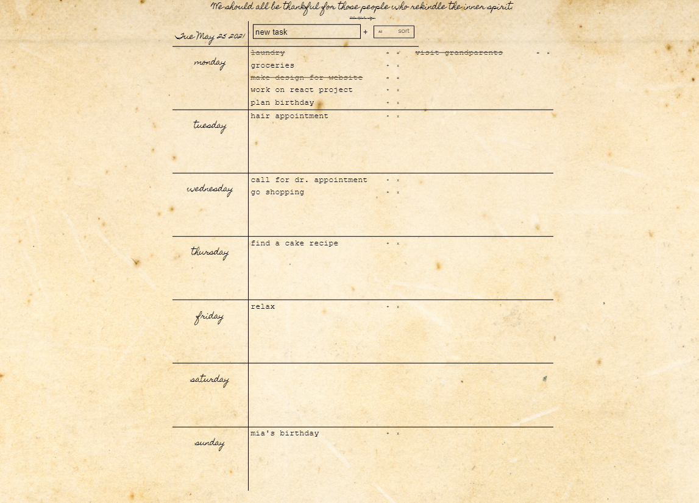
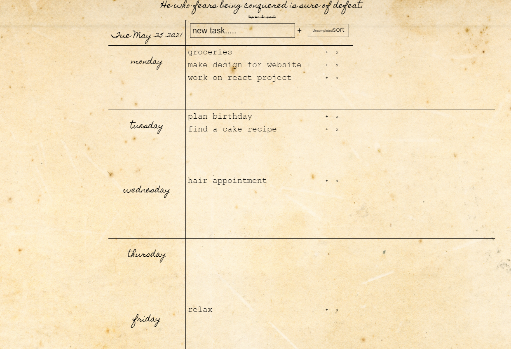

Vintage looking weekly To Do List in single page form created with JavaScript. Perfect for desktop and tablet use. Displays random quote on refresh, shows current date and stores your chores in local storage. Allows adding new chore, crossing it, and dragging it inbetween days, as well as deleting it and sorting by completion.

Features:
-new motivational quote on refresh
-today's date
-local storage of todos
-crossover done todos
-delete todo
-filter todo: all/completed/uncompleted
-drag and drop of todos between and inside days

More features to come:
-responsive design for mobile devices
-keeping sorted items in days on refresh

